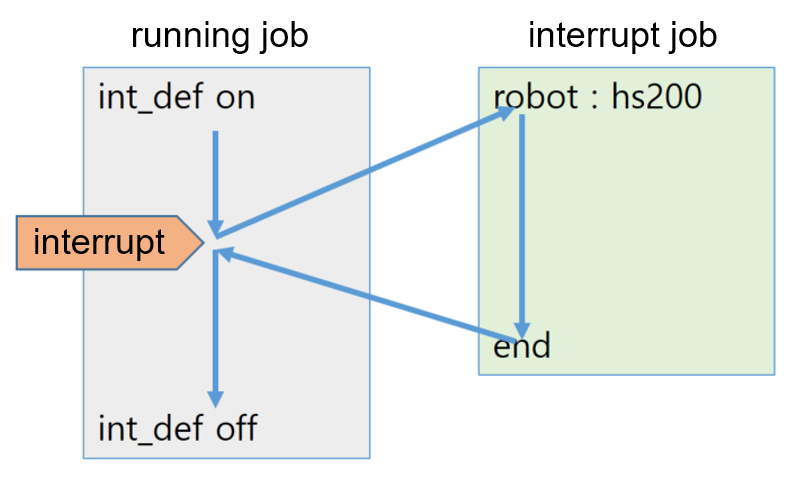

# 10.1.5 intr_def

`intr_def` is a procedure that specifies interrupt condition, watch-interval, and program to run when an interrupt occurs.

### Syntax

An interrupt function is a type of program call. When the robot works in an interrupt watch-interval, it calls a specified job when it meets the predefined interrupt conditions. When the called-program finishes running, it returns to the previous running program's location and continues to run.





### Brief

- Operates only in interrupt watch intervals.
- Arithmetic expressions are supported as interrupt conditional expressions.
- Allow another interrupt handling (multiple interrupt) while performing an interrupt program.


### Timepoint when the interrupt is cleared

All defined interrupts are automatically cleared if the following actions occur.

- When performing 'R0: Task Reset'
- The first time the program runs
- When starting after changing the program counter (step/func #)


### Sample

```python
intr_def <on/off>,no=<interrupt number>,var=<interrupt condition>,val=<condition matching value>,job=<call program number>,[once]
```

### Parameters

<table>
  <thead>
    <tr>
      <th style="text-align:left">Parameter</th>
      <th style="text-align:left">Description</th>
      <th style="text-align:left">Remarks</th>
    </tr>
  </thead>
  <tbody>
  <tr>
      <td style="text-align:left">on/off</td>
      <td style="text-align:left">
        Define interrupts or delete defined interrupts<br>
        <ul>
        <li>on: Defines a new interrupt.</li>
        <li>off: Deletes defined interrupt. (3rd and later parameters are ignored.)</li>
        </ul>
      </td>
      <td style="text-align:left">on/off</td>
    </tr>
    <tr>
      <td style="text-align:left">interrupt number</td>
      <td style="text-align:left">
        The interrupt number to define or delete.<br>
      </td>
      <td style="text-align:left">arithmetic expression</td>
    </tr>
    <tr>
      <td style="text-align:left">interrupt condition</td>
      <td style="text-align:left">
        The conditional expression that will cause an interrupt.
      </td>
      <td style="text-align:left">variable</td>
    </tr>
    <tr>
      <td style="text-align:left">condition matching value</td>
      <td style="text-align:left">
        The value of the conditional expression to generate interrupt.
      </td>
      <td style="text-align:left">arithmetic expression</td>
    </tr>
    <tr>
      <td style="text-align:left">call program number</td>
      <td style="text-align:left">
        Program number to call when an interrupt occurs.
      </td>
      <td style="text-align:left">arithmetic expression</td>
    </tr>
    <tr>
      <td style="text-align:left">[once]</td>
      <td style="text-align:left">
        handles only one interrupt in the interrupt watch interval without processing additional interrupts.
      </td>
      <td style="text-align:left">once</td>
    </tr>
  </tbody>
</table>


### Errors

- E1351 : Occurs when redefine an already-defined interrupt number without deletion. Please check the program that was created.


### Sample

```python
   intr_def on,no=1,var=di5,val=1,job=24,once # Defines interrupt
   move P,spd=30%,accu=3,tool=1
   move L,spd=30mm/s,accu=3,tool=1
   ...
   move L,spd=30mm/s,accu=3,tool=1
   move P,spd=30%,accu=3,tool=1
   intr_def off,no=1 # Deletes interrupt
   move P,spd=30%,accu=3,tool=1
   end
```
