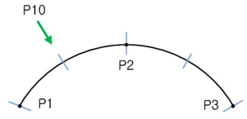

# 10.2.1 segment 함수

segment 함수는 시작위치와 종료위치간의 거리를 균등 분할하는 함수입니다.

### 설명

함수 인자의 시작위치와 종료위치간의 거리를 균등 분할하여 지정한 카운터에 해당하는 위치, 자세를 고려한 포즈 값을 포즈변수에 저장합니다.


예를 들어 P3=segment(P1,P2,3,2) 인 경우, 
P1시작위치에서 P2목표위치간의 거리를 3등분하여 지정한 2번째 포즈의 위치와 자세를 고려한 포즈 값을 P3 포즈변수에 저장합니다.

함수의 인자에 경유위치를 추가하면, 시작위치와 경유점, 목표위치로 이루어진 원호상의 거리를 균등 분할하여 지정한 카운터에 위치, 자세를 고려한 포즈 값을 포즈변수에 저장합니다.



예를 들어 P10=segment(P1,P2,P3,4,2) 인 경우,
P1시작포즈, P2 경유포즈 P3목표포즈로 이루어진 원호상의 거리를 4등분하여 지정한 2번째 포즈의 위치와 자세를 고려한 포즈 값을 P10 포즈변수에 저장합니다.
<br><br>

### 문법

```python
result=segment(<시작포즈>,<종료포즈>,<분할 수>,<카운터>)
```

```python
result=segment(<시작포즈>,<경유포즈>,<종료포즈>,<분할 수>,<카운터>)
```

### 파라미터
<table>
  <thead>
    <tr>
      <th style="text-align:left">항목</th>
      <th style="text-align:left">의미</th>
      <th style="text-align:left">기타</th>
    </tr>
  </thead>
  <tbody>
    <tr>
      <td style="text-align:left">시작포즈</td>
      <td style="text-align:left">
        시작 위치
      </td>
      <td style="text-align:left">포즈변수</td>
    </tr>
    <tr>
      <td style="text-align:left">경유포즈</td>
      <td style="text-align:left">
        경유 위치
      <td style="text-align:left">포즈변수</td>
    </tr>
    <tr>
      <td style="text-align:left">종료포즈</td>
      <td style="text-align:left">
        종료 위치
      </td>
      <td style="text-align:left">포즈변수</td>
    </tr>
    <tr>
      <td style="text-align:left">분할 수</td>
      <td style="text-align:left">
        분할 수<br>
        (1 ~ 30000)
      </td>
      <td style="text-align:left">변수</td>
    </tr>
    <tr>
      <td style="text-align:left">카운터</td>
      <td style="text-align:left">
        저장할 포즈의 카운터 번호<br>
        (0 ~ 300000, 0: 시작포즈)
      </td>
      <td style="text-align:left">변수</td>
    </tr>
  </tbody>
</table>

### 사용 예

```python
     var po1,po2,po3
     po1=Pose(1000.000,0.000,1938.000,0.000,0.000,0.000) # 시작포즈
     po2=Pose(2000.000,0.000,1938.000,0.000,0.000,0.000) # 종료포즈
     po3=segment(po1,po2,4,2)
     end
```

```python
     var po1,po2,po3,po10
     po1=Pose(1000.000,0.000,1938.000,0.000,0.000,0.000) # 시작포즈
     po2=Pose(1500.000,500.000,1938.000,0.000,0.000,0.000) # 경유포즈
     po3=Pose(2000.000,0.000,1938.000,0.000,0.000,0.000) # 종료포즈
     po10=segment(po1,po2,po3,5,3)
     end
```