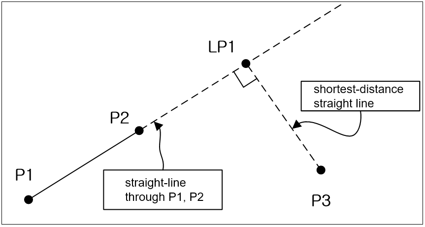
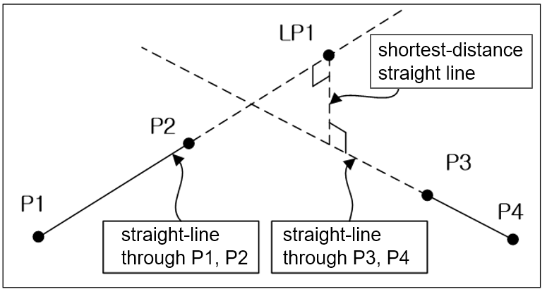

# 10.2.3 intersection

You can use the `intersection` function to find a point that meets a straight line at the shortest distance of one point, or to find an intersection with a straight line at the shortest distance that passes.

### Description

If you specify two points that form a straight line and another point as the parameters, you obtain a cross-pose of a straight line that connects the straight line and one point at the shortest distance.



If you specify two points that form a straight line and two points that form another straight line as the parameters, you can find the intersection of the two straight lines at the shortest distance. The intersection point is the intersection with the first straight line you specify.




### Syntax

```python
result=intersection(<straight-line ref.pose 1>,<straight-line ref.pose 2>,<position ref.pose>)
```

```python
result=intersection(<straight-line ref.pose 1>,<straight-line ref.pose 2>,<straight-line ref.pose 3>,<straight-line ref.pose 4>)
```

### Return value

The result pose.


### Parameters
<table>
  <thead>
    <tr>
      <th style="text-align:left">Parameter</th>
      <th style="text-align:left">Description</th>
      <th style="text-align:left">Remarks</th>
    </tr>
  </thead>
  <tbody>
    <tr>
      <td style="text-align:left">straight-line ref.pose 1</td>
      <td style="text-align:left">
        1st reference pose of 1st straight-line
      </td>
      <td style="text-align:left">pose expression</td>
    </tr>
    <tr>
      <td style="text-align:left">straight-line ref.pose 2</td>
      <td style="text-align:left">
        2nd reference pose of 1st straight-line
      <td style="text-align:left">pose expression</td>
    </tr>
    <tr>
      <td style="text-align:left">position ref.pose</td>
      <td style="text-align:left">
        Pose referenced to find a straight line and shortest distance position
      </td>
      <td style="text-align:left">pose expression</td>
    </tr>
    <tr>
      <td style="text-align:left">straight-line ref.pose 3</td>
      <td style="text-align:left">
        1st reference pose of 2nd straight-line
      </td>
      <td style="text-align:left">pose expression</td>
    </tr>
    <tr>
      <td style="text-align:left">straight-line ref.pose 4</td>
      <td style="text-align:left">
        2st reference pose of 2nd straight-line
      </td>
      <td style="text-align:left">pose expression</td>
    </tr>
  </tbody>
</table>

### Sample

```python
     var po1,po2,po3,result
     po1=Pose(1000.000,0.000,1938.000,0.000,0.000,0.000)
     po2=Pose(2000.000,0.000,1938.000,0.000,0.000,0.000)
     po3=Pose(2500.000,500.000,1938.000,0.000,0.000,0.000)
     result=intersection(po1,po2,po3)
     end
```

```python
     var po1,po2,po3,po4,result
     po1=Pose(1000.000,0.000,1938.000,0.000,0.000,0.000)
     po2=Pose(1500.000,500.000,1938.000,0.000,0.000,0.000)
     po3=Pose(2000.000,0.000,2000.000,0.000,0.000,0.000)
     po4=Pose(2000.000,0.000,2000.000,0.000,0.000,0.000)
     result=intersection(po1,po2,po3,po4)
     end
```

