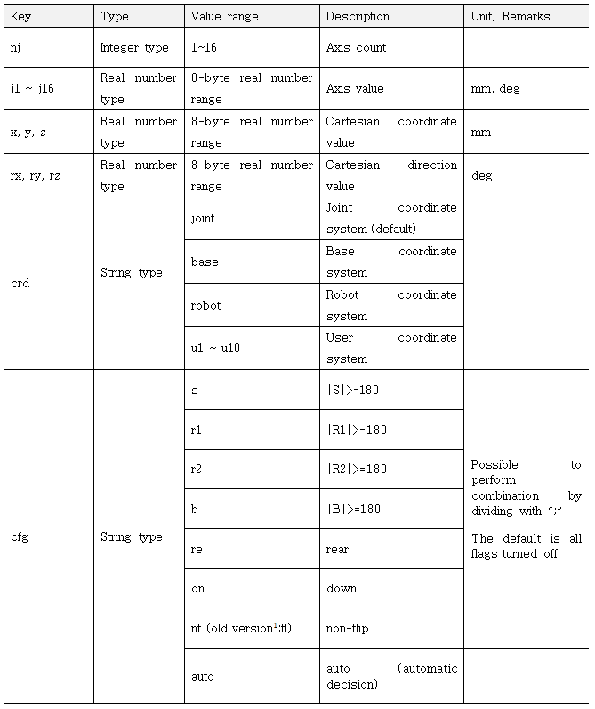

# 5.1 Pose

Pose is an object type embedded in the Hi6 Controller and represents each axis of the robot or the Cartesian coordinates and direction of the tool tip. 

Poses are created by calling the constructor function Pose\( \). All function parameters are position parameters. Meanwhile, crd and cfg are string types, and the rest are number types.


The cfg element specifies the robot configuration. For more information, refer to "[2.3.2.2 Base and Robot Recording Coordinates](https://hrbook-asoe72.web.app/#/view/doc-hi6-operation/english/operation/step/step-pose-modify/base-robot-crd-sys)" in the Hi6 Robot Controller Operation Manual.



```python
var <pose variable name> = Pose(j1, j2, j3, …)					# axis coordinate
var <pose variable name> = Pose(x, y, z, rx, ry, rz, j7, j8,…, crd, cfg)		# base coordinate
```

Refer to the following examples of creating the poses for 6 axes + 1 additional axis and for Cartesian + 1 additional axis.

```python
var po1 = Pose(10, 90, 0, 0, -30, 0, -1240.8)				# axis coordinate
var po2 = Pose(1850, 0, 2010.5, 0, -90, 0, -1240.8, "base", "fl;r2")	# base coordinate
```

Alternatively, the pose constructor function may be called using a single array or string parameter. With this, files or data may be converted into poses, acquired through remote communication, and used.

```python
var <pose variable name> = Pose(array)
var <pose variable name> = Pose(string)
```

Refer to the following example.

```python
var arr = [10, 90, 0, 0, -30, 0, -1240.8]
var str = "[1850, 0, 2010.5, 0, -90, 0, -1240.8, \"base\", \"fl;r2\"]"
var po3 = Pose(arr)
var po4 = Pose(str)
```

Elements of the pose object can be accessed with the following keys.



1. For V60.06-06 or older versions, fl is non-fl.

The pose element values can be accessed as shown in the following example.

```python
po1.j2 = po1.j2 + 5
print po2.z, po2.cfg
```


