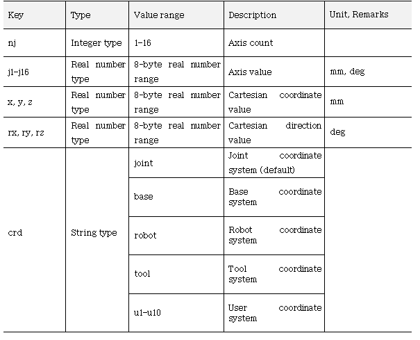

# 5.2 Shift

Shift is an object type embedded in the Hi6 Controller and represents the pose’s change value. 

Shifts are created by calling the constructor function Shift\( \). All function parameters are position parameters. Meanwhile, crd and cfg are string types, and the rest are number types.


```python
var <shift variable name> = Shift(j1, j2, j3, …)				# axis coordinate
var <shift variable name> = Shift(x, y, z, rx, ry, rz, j7, j8,…, crd)		# base coordinate
```

Refer to the following examples of creating the shifts for 6 axes + 1 additional axis and for Cartesian + 1 additional axis.

```python
var sft1 = Shift(30, 0, 0, 0, -5.8, 0, -120)				# axis coordinate
var sft2 = Shift(0, 0, 55.2, 0, -5, 0, -120, "base")			# base coordinate
```

Alternatively, the constructor function shift may be called using a single array or string parameter. With this, files or data may be converted into shifts, acquired through remote communication, and used.

```python
var <shift variable name> = Shift(array)
var <shift variable name> = Shift(string)
```

Refer to the following example.

```python
var arr = [30, 0, 0, 0, -5.8, 0, -120]
var str = "[0, 0, 55.2, 0, -5, 0, -120, \"base\"]"
var sft3 = Shift(arr)
var sft4 = Shift(str)
```

Elements of the shift object can be accessed with the following keys.



